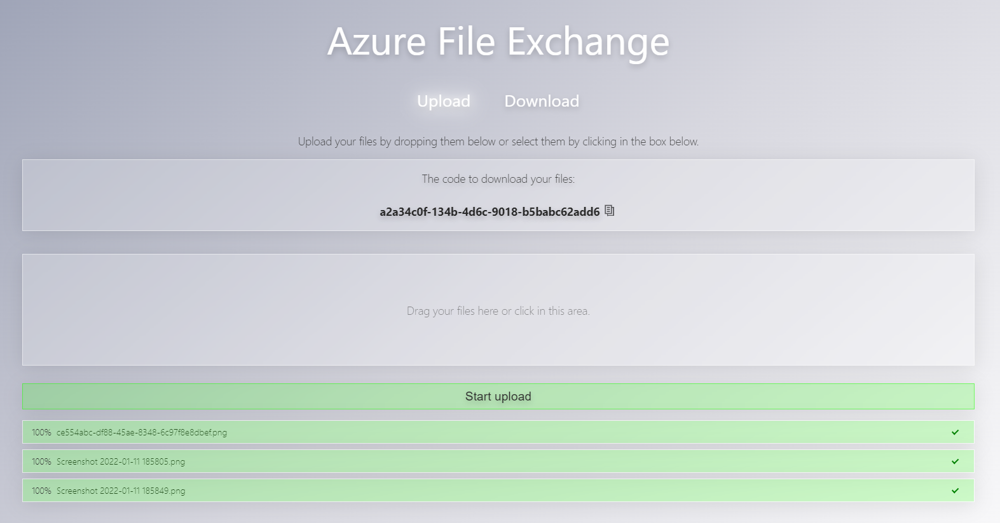

# CZ.Azure.FileExchange

This project provides a website to share fast files with the help of azure.
You get an upload website that looks like this:



The important thing there is the guid that is displayed after uploading a file.
This can be used on the download page:


A demo can be used here:
[https://kind-dune-004c2c103.azurestaticapps.net](https://kind-dune-004c2c103.azurestaticapps.net)

## Status

| Azure DevOps | GitHub Action |
| ------------ | ------------- |
| [](https://dev.azure.com/czon/CZ.Azure.FileExchange/_build/latest?definitionId=9&branchName=main) | [](https://github.com/codez-one/CZ.Azure.FileExchange/actions/workflows/main.yml) |

## Deployment

In every [release](https://github.com/codez-one/CZ.Azure.FileExchange/releases/latest) of this repository you will find a `azuredeploy.json`.
Just take this json and deploy it [here](https://portal.azure.com/#create/Microsoft.Template).
After this you have in your resource group an storage account and a static web app.

After this download the two ZIPs of the release (API.zip & Frontend.zip) and extract them.

After this you can run the script [`deploy.ps1`](https://github.com/codez-one/CZ.Azure.FileExchange/blob/20220111.21/build/deploy.ps1) with the following parameters from any powershell:

```powershell
$token = Read-Host -MaskInput;
./deploy.ps1 -Token $token -appBuildOutput path-to-the-extrated-frontend-zip -apiBuildOutput path-to-the-extracted-api-zip
```

> Information: The token you get in the azure portal from the overview page of the static webapp. It's called `deployment token`.

### Build App

> Important: If you want deploy this, build it on linux!

```powershell
dotnet build
dotnet publish .\src\CZ.Azure.FileExchange\ -o temp/fe
dotnet publish .\src\CZ.Azure.FileExchange.Api\ -o temp/api
```

### Run the App local

Pull and run [azurite](https://github.com/azure/azurite) on your local machine. (it will simulate azure blob storage on your machine)

```powershell
docker run -p 10000:10000 -p 10001:10001 -p 10002:10002 mcr.microsoft.com/azure-storage/azurite
```


### Publish the App

```powershell
$token = Read-Host -MaskInput;
./build/deploy.ps1 -Token $token -appBuildOutput ./temp/fe/wwwroot/ -apiBuildOutput ./temp/api/
```

> Important: You must configure your storage account with the cors ruls, so it accepts request from your static websites hostname....

- enjoy

#### Publish a stage

To publish a stage the deploy script needs some more parameters:

```powershell
$token = Read-Host -MaskInput;
$branchName = git branch --show-current;
$PrId = "Replace this string with the Id of your PR here";
$PrTitle = "Replace this string with the title of your PR";
./build/deploy.ps1 -Token $token -appBuildOutput ./temp/fe/wwwroot/ -apiBuildOutput ./temp/api/ -envrionmentName $PrId -pullrequestTitle $PrTitle -branchName $branchName
```

#### Delete a stage

To delete a stage just add the delete parameter:

```powershell
$token = Read-Host -MaskInput;
$branchName = git branch --show-current;
$PrId = "Replace this string with the Id of your PR here";
$PrTitle = "Replace this string with the title of your PR";
./build/deploy.ps1 -Token $token -appBuildOutput ./temp/fe/wwwroot/ -apiBuildOutput ./temp/api/ -envrionmentName $PrId -pullrequestTitle $PrTitle -branchName $branchName -Delete
```
