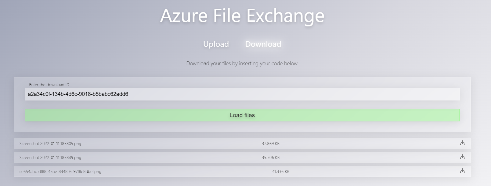

# Cz.Tools.FileExchange

This project provides a website to share fast files with the help of azure.
You get an upload website that looks like this:


The important thing there is the guid the is displayed after uploading a file.
This can be used on the download page:



## Deployment

- compile the `main.bicep` file
- deploy it to azure

### Build App

```powershell
dotnet build
dotnet publish .\src\Cz.Tools.FileExchange\ -o temp/fe
dotnet publish .\src\Cz.Tools.FileExchange.Api\ -o temp/api
```

### Publish the App

```powershell
$token = Read-Host -MaskInput;
./build/deploy.ps1 -Token $token -appBuildOutput ./temp/fe/wwwroot/ -apiBuildOutput ./temp/api/
```

> Important: You must configure your storage account with the cors ruls, so it accepts request from your static websites hostname....

- enjoy