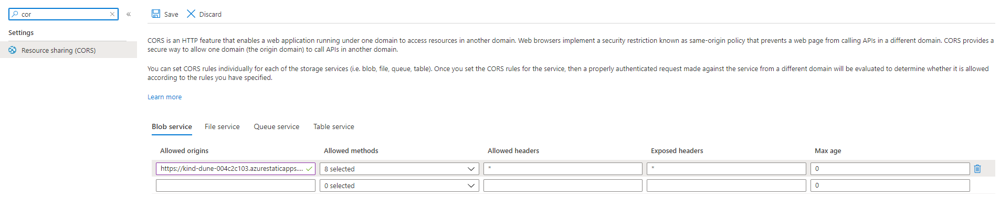

# CZ.Azure.FileExchange

This project provides a website to share fast files with the help of azure.
You get an upload website that looks like this:


The important thing there is the guid that is displayed after uploading a file.
This can be used on the download page:


## Deployment

In every [release](https://github.com/codez-one/CZ.Azure.FileExchange/releases/latest) of this repository you will find a `azuredeploy.json`.
Just take this json and deploy it [here](https://portal.azure.com/#create/Microsoft.Template).
After this you have in your resource group an storage account and a static web app.
Find out the URL of your static website add the CORS rule for it:



After this download the two ZIPs of the release (API.zip & Frontend.zip) and extract them.

After this you can run the script [`deploy.ps1`](https://github.com/codez-one/CZ.Azure.FileExchange/blob/20220111.21/build/deploy.ps1) with the following parameters from any powershell:

```powershell
$token = Read-Host -MaskInput;
./deploy.ps1 -Token $token -appBuildOutput path-to-the-extrated-frontend-zip -apiBuildOutput path-to-the-extracted-api-zip
```

> Information: The token you get in the azure portal from the overview page of the static webapp. It's called `deployment token`.

### Build App

```powershell
dotnet build
dotnet publish .\src\CZ.Azure.FileExchange\ -o temp/fe
dotnet publish .\src\CZ.Azure.FileExchange.Api\ -o temp/api
```

### Publish the App

```powershell
$token = Read-Host -MaskInput;
./build/deploy.ps1 -Token $token -appBuildOutput ./temp/fe/wwwroot/ -apiBuildOutput ./temp/api/
```

> Important: You must configure your storage account with the cors ruls, so it accepts request from your static websites hostname....

- enjoy